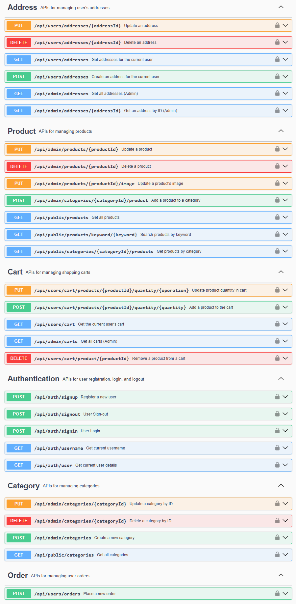

# Spring Boot eCommerce API

[](https://www.java.com)
[](https://spring.io/projects/spring-boot)
[](https://www.postgresql.org/)
[](https://opensource.org/licenses/MIT)

A backend for an e-commerce platform built with Java and Spring Boot. This project demonstrates a complete RESTful API with JWT-based security for managing users, addresses, products, categories, carts and orders.

| Live API Documentation (Swagger UI)                                                                                               |
|-----------------------------------------------------------------------------------------------------------------------------------|
| [Explore the API](http://ecommerce-app-env.eba-fsx2e3s2.eu-north-1.elasticbeanstalk.com/swagger-ui/index.html) / screenshot below |

---

## ✨ Features

* **User Authentication:** Secure registration, login, and logout endpoints using **Spring Security** and **JWT**.
* **Role-Based Access Control:** Clear distinction between `USER` and `ADMIN` roles for accessing different endpoints.
* **Product & Category Management:** Full CRUD (Create, Read, Update, Delete) operations for products and categories.
* **Shopping Cart:** Functionality for authenticated users to add, update, and remove products from their personal cart.
* **Address Management:** Users can manage multiple personal addresses for shipping.
* **Order Placement:** A streamlined process for creating an order from the contents of the shopping cart.
* **Interactive API Documentation:** A live **Swagger UI** endpoint for easy exploration and testing of all API functionalities.

---

## 🛠️ Tech Stack

* **Framework:** Spring Boot (Web, Security, Data JPA)
* **Language:** Java 21
* **Database:** PostgreSQL (Production), H2 In-Memory (Development)
* **Security:** JSON Web Tokens (JWT)
* **Build Tool:** Apache Maven
* **Utilities:** Lombok, ModelMapper
* **Deployment:** AWS Elastic Beanstalk, AWS RDS (PostgreSQL)
* **API Documentation:** OpenAPI (SpringDoc)

---

## 🚀 Getting Started

You have two primary ways to interact with this project:

### 1. Use the Live API (Recommended) 🔛

The easiest way to test the API is through the live version deployed on AWS. The interactive Swagger UI documentation allows you to test all endpoints directly from your browser.

* **Base URL:** `http://ecommerce-app-env.eba-fsx2e3s2.eu-north-1.elasticbeanstalk.com`
* **Swagger UI:** **[http://ecommerce-app-env.eba-fsx2e3s2.eu-north-1.elasticbeanstalk.com/swagger-ui/index.html](http://ecommerce-app-env.eba-fsx2e3s2.eu-north-1.elasticbeanstalk.com/swagger-ui/index.html)**

#### Demo Account for the Live Version

To test the secured endpoints on the deployed version, you can log in with the following demo account:

`.../api/auth/signin`

* **Username:** `user1`
* **Password:** `user1`

This account has the `USER` role and will allow you to test all public (`/public`) and user-specific (`/users`) endpoints, such as managing your cart, addresses, and creating orders. Access to administrative (`/admin`) endpoints requires an `ADMIN` role.

### 2. Run the Project Locally 💻

If you wish to run the application on your own machine (and get admin access), follow these steps using IntelliJ IDEA.

#### Prerequisites

* Git
* JDK 21 or newer
* Apache Maven (usually bundled with IntelliJ)

#### Installation & Execution

1.  **Clone the repository:**
    ```bash
    git clone https://github.com/tibormares/ecommerce-project.git
    ```

2.  **Open in IntelliJ IDEA:**
    * Open IntelliJ IDEA and select `File -> Open...` and navigate to the cloned project folder.


3.  **Run the application:**
    * Navigate to the main application class located at `src/main/java/com/ecommerce/project/SbEcomApplication.java`.
    * Click the green "play" icon ▶️ next to the `main` method to start the application.
    * The application will be available at `http://localhost:5000`. You can now send requests to the API.


The project is configured with a `dev` profile that runs out-of-the-box with an H2 in-memory database, requiring no extra setup.

> **Explore the Database:** While the application is running locally, you can view the H2 database console in your browser at http://localhost:5000/h2-console/.  
> Use the JDBC URL `jdbc:h2:mem:test`, username `sa`, and password `password` to log in.

## 🧑‍🤝‍🧑 Default Users (for Local Setup)

When running in the `dev` profile (the default for local execution), the following test users are automatically created in the database, including a full-access admin.

| Role      | Username | Password |
|-----------|----------|----------|
| **Admin** | `admin1` | `admin1` |
| **User**  | `user1`  | `user1`  |

**Note:** These accounts are only created when running the project locally. To test the deployed version, please use the `user1` demo account mentioned above.

## 🛜 API endpoints
